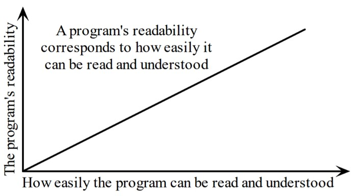

```{r setup, include=FALSE}
knitr::opts_chunk$set(
  echo = TRUE,
  comment = NA,
  engine.path = list(python = '/usr/local/bin/python3')
)

#library(reticulate)
```

https://thenextweb.com/syndication/2020/10/09/i-thought-i-had-mastered-python-until-i-discovered-these-tricks/

by KAMAL CHOUHBI

Python is one of the most popular programming languages for beginner developers, making it the most widely taught language in schools around the world.

However, learning Python is not an easy thing. To get started, you first need to find the best online way to get there, which is difficult in itself. There are thousands of Python courses and tutorials, all claiming to be the best.

True, practice alone is not perfect, but perfect practice is. This means you need to make sure you’re always following the best coding practices (commenting on your code, using correct syntax, etc.), otherwise you’ll likely end up adopting bad habits that could harm your future lines of code.

>*A universal convention supplies all of maintainability, clarity, consistency, and a foundation for good programming habits too. What it doesn’t do is insist that you follow it against your will. That’s Python!* — Tim Peters on comp.lang.python, 2001–06–16

In this article, I’m going to give my top 10 tips to help you code in Python quickly and efficiently.

## 1. Readability is important

>*Programs must be written for people to read, and only incidentally for machines to execute.* - Hal Abelson

First of all, try to make your programs easy to read by following some programming conventions. A programming convention is one that a seasoned programmer follows when writing his or her code. There’s no quicker way to reveal that you’re a “newbie” than by ignoring conventions. Some of these conventions are specific to Python; others are used by computer programmers in all languages.

{width=100%}

Essentially, readability is the characteristic which specifies how easy another person can understand some parts of your code (and not you!).

As an example, I was not used to write with vertical alignment and to align the function’s parameters with opening delimiter.

```
# No - avoid:
func = long_function_name(var_one, var_two,
       var_there, var_four)

# Yes:
func = long_function_name(var_one, var_two,
                          var_there, var_four)
```

Look at other examples in the [Style Guide for Python Code](https://www.python.org/dev/peps/pep-0008/) and decide what looks best.

Another important thing that we do very often is resembling programs that we have seen or written before, which is why our exposure to readable programs is important in learning programming.

## 2. Avoid un-useful conditions

Often, a long `if`, `elif`, ..., `else` conditions is the sign of code that needs refactoring, these conditions make your code lengthy and really hard to interpret. Sometimes they can easily be replaced, for example, I used to do the following:

```
def f():
    if condition:
        return True
    else:
        return False
```

This is just dumb! The function is returning a boolean, so why even use if blocks in the first place? The correct what of doing this would be:

```
def f():
    return condition
```

In a [Hackerrank](https://www.hackerrank.com/dashboard) challenge, you are given the year and you have to write a function to check if the year is leap or not. In the Gregorian calendar three criteria must be taken into account to identify leap years:

- The year can be evenly divided by 4, is a leap year, unless:

- The year can be evenly divided by 100, it is NOT a leap year, unless:

- The year is also evenly divisible by 400
    + Then it is a leap year

So in this challenge, forget about `if` and `else` statements and just do the following:

```
df is_leap(year):
    return y % 4 == 0 and (year % 400 == 0 or year % 100 != 0)
```

## 3. Adequate use of Whitespace

- Never mix tabs and spaces

- A line break between functions

- Two line breaks between classes

- Add a space after “,” in dictionaries, lists, tuples, arguments in a list of arguments and after “:” in dictionaries but not before

- Put spaces around assignments and comparisons (except for arguments in a list)

- No space for opening and closing parentheses or just before a list of arguments

```
def function(key, value=0):
    """Return a dictionary and a list..."""
    d = {key: value}
    l = [key, value]
    return d, l
```

## 4. Docstrings and Comments

- Docstrings = How to use the code

- Comments = Why (rational) and how the code works

The docstrings explain how to use the code :

- Explain the purpose of a function even if it seems obvious to you because it will not necessarily seem obvious to another person later

- Describe the expected parameters, the returned values and the exceptions raised

- If the method is strongly coupled to a single caller, mention the calling function

The comments explain what are for the maintainers of your code. Examples including notes for yourself, such as:

```
# !!! BUG: …

# !!! FIX: This is a hack

# ??? Why is this here?
```

It is on your responsibility to write good docstrings and good comments, so always keep them up to date! When making changes, make sure the comments and docstrings are consistent with the code.

You will find a detailed PEP dedicated for Doctsrings: [“Docstring Conventions”](https://www.python.org/dev/peps/pep-0257/)

## 5. Variables and Assignment

In other programming languages :

```
c = a
a = b
b = c
```

In Python, it’s better to use the assignment in one line code :

```
b, a = a, b
```

You may have already seen it but do you know how it works?

- The comma is the syntax for building the tuple

- A tuple is created on the right (tuple packing)

- A tuple is the target on the left (tuple unpacking)

Other examples:

```{python}
user = ['Jan', 'Gomez', '+1-888-222-1546']
name, title, phone = user
name
title
phone 
```

Useful in loops on structured data (the variable user above has been kept):

```{python}
people = [user, ['German', 'GBT', 'unlisted']]
for (name, title, phone) in people:
    print(name, phone)
```

It is also possible to do the opposite way, just make sure you have the same structure on the right and on the left:

```{python}
jan, (gname, gtitle, gphone) = people
gname 
gtitle 
gphone 
jan
```

## 6. List Concatenation & Join

Let’s start with a list of strings:

```{python}
colors = ['red', 'blue', 'green', 'yellow']
```

We want to concatenate these chains together to create a long one. Particularly when the number of substrings is large, avoid doing this :

```{python}
result = ''
for s in colors:
    result += s
result
```

It is very slow. It uses a lot of memory and performance. The sum will add up, store, and then move on to each intermediate step.

Instead, do this:

```{python}
result = ''.join(colors)
result
```

The `join()` method makes the entire copy in one pass. When you only process a few strings, it makes no difference. But get into the habit of building your chains optimally, because with hundreds or thousands strings, it will truly make a difference.

Here are some techniques for using the `join()` method. If you want a space as a separator:

```{python}
result = ' '.join(colors)
result
```

or a comma and a space:

```{python}
result = ', '.join(colors)
result
```

To make a grammatically correct sentence, we want commas between each value except the last one, where we prefer an “or”. The syntax for splitting a list does the rest. The `[: -1]` returns everything except the last value, which we can concatenate with our commas.

```{python}
colors = ['red', 'blue', 'green', 'yellow']
print('Choose', ', '.join(colors[:-1]), 'or', colors[-1])
```

## 7. Test true conditions

It is elegant and quick to take advantage of Python with regard to Boolean values.

*Do this:*

```
if x:
    pass
```

*And not this:*

```
if x == True:
    pass
```

*Do this:*

```
if items:
    pass
```

*And not this:*

```
if len(items) != 0:
    pass
```

*And especially not this:*

```
if items != []:
    pass
```

## 8. Use enumerate when it’s possible

The enumerate function takes a list and returns pairs (index, item):

```{python}
items = ['zero', 'one', 'two', 'three']
print(list(enumerate(items)))
```

It is necessary to use a list to display the results because enumerate is a lazy function, generating one item (a pair) at a time, only when requested. A `for` loop requires such a mechanism. Print does not take one result at a time but must be in possession of the entire message to be displayed. We therefore automatically converted the generator to a list before using print.

So, using the loop below is much better:

```{python}
for (index, item) in enumerate(items):
    print(index, item)
```

compared to

```{python}
index = 0
for item in items:
    print(index, item)
    index += 1
```

and

```{python}
for i in range(len(items)):
    print(i, items[i])
```

The version with enumerate is shorter and simpler than the two other versions. An example showing that the enumerate function returns an iterator (a generator is a kind of iterator)

## 9. List Comprehension

The traditional way with `for` and `if`:

```
new_list = []
for item in a_list:
    if condition(item):
        new_list.append(fn(item))
```

Using a list comprehension:

```
new_list = [fn(item) for item in a_list if condition(item)]
```

The list comprehensions are clear and direct. You can have several `for` loops and if conditions within the same list comprehensions, but beyond two or three, or if the conditions are complex, I suggest you use the usual `for` loop.

For example, the list of squares from 0 to 9:

```{python}
[n ** 2 for n in range(10)]
```

The list of odd numbers within the previous list:

```{python}
[n ** 2 for n in range(10) if n % 2]
```

Another example:

```{python}
[(x, y) for x in (1, 2, 3, 4) if x % 2 == 0 for y in ['a', 'b'] if y == 'b']
```

## 10. Generator expressions

Let’s sum the squares of numbers less than 100.

*With a loop:*

```{python}
total = 0
for num in range(1, 101):
    total += num * num
total
```

We can also use the sum function which does the job faster for us by building the right sequence.

*With a list comprehension:*

```{python}
total = sum([num * num for num in range(1, 101)])
total
```

*With a generator expression:*

```{python}
total = sum(num * num for num in range(1, 101))
total
```

The generator expressions are like list comprehensions, except in their calculation, they are lazy. List comprehensions calculate the entire result in a single pass, to store it in a list. Generator expressions calculate one value at a time, when necessary. This is particularly useful when the sequence is very long and the generated list is only an intermediate step and not the final result.

For example if we have to sum the squares of several billion integers, we will reach a saturation of the memory with a list comprehension, but the generator expressions will not have any problem. Well, it will take a while though!

```{python}
total = sum(num * num for num in range(1, 1000000000))
total
```

The difference in syntax is that list comprehensions have square brackets, while generator expressions do not. Generator expressions sometimes require parentheses, so you should always use them.

In short:

- Use a list comprehension when the expected result is the list

- Use a generator expression when the list is only an intermediate result

>*Debugging is twice as hard as writing the code in the first place. Therefore, if you write the code as cleverly as possible, you are, by definition, not smart enough to debug it.* - Brian Kernighan https://www.azquotes.com/quote/669106

In this article, I have presented some of my best tips for learning to program in Python. If you really want to become a programmer or add a coding skill to your skills, learning Python is a great place to start. Look for high quality Python training online and start to find out how to program in Python. I recommend that you learn the basics with an interactive course before moving on to more difficult concepts.

You should not speed up the learning process too much, or you may miss important information. Take notes and make sure to review them regularly and try to practice writing code as often as possible.

Connect with colleagues who are learning like you and don’t be afraid to ask questions when you have them. Helping others when they have problems can be a great review, and working with someone else’s code is a great way to learn new things.

If you do all of this, nothing can stop you! So what are you waiting for? Start programming in Python now!

This article was written by [Kamal Chouhbi](https://towardsdatascience.com/@chouhbik) and originally published on Towards Data Science. You can read the piece [here](https://towardsdatascience.com/i-thought-i-was-mastering-python-until-i-discovered-these-tricks-e40d9c71f4e2).
